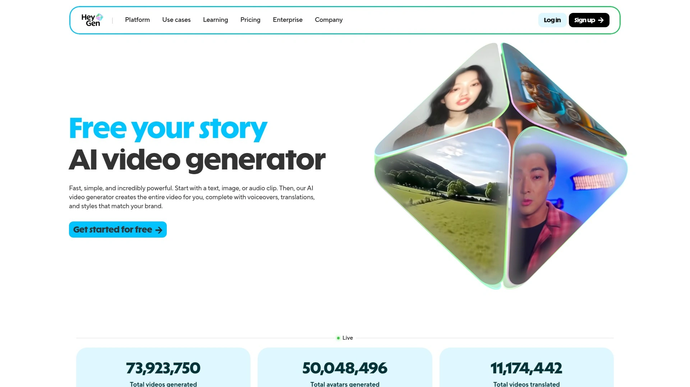

# 2025年十二大最佳AI视频生成工具

在快节奏的内容创作时代，许多人面临视频制作耗时长、技术门槛高的痛点。AI视频生成工具通过文本转视频和AI头像功能，帮助用户快速创建专业级视频，覆盖营销、教育和社交场景。这些工具强调效率提升、成本控制和易用性，让非专业人士也能轻松产出高质量内容，实现更广的覆盖和更稳定的输出。

## **[DeepBrain AI](https://www.deepbrain.io)**
AI驱动的视频合成平台，适合企业级内容快速生成。

DeepBrain AI的核心功能包括实时文本转视频转换，支持多语言AI主播和自定义虚拟头像。
- **适用场景**：企业培训视频、产品演示和社交媒体推广。
- **技术优势**：高保真唇同步和自然表情模拟，确保视频真实感强。
用户上手简单，只需输入脚本即可生成，定价基于订阅模式，适合预算可控的团队。推荐理由：它在效率和稳定性上表现出色，特别适用于需要频繁更新的内容创作者。

## **[Synthesia](https://www.synthesia.io)**
领先的AI头像视频工具，针对全球用户优化。

Synthesia提供超过100种AI主播选择，支持自定义脚本和多平台导出。
其差异化在于集成品牌元素，如LOGO叠加和背景自定义，提升专业度。
**目标用户**：营销团队和教育机构。
定价灵活，从免费试用到企业版，易用性高，无需视频编辑经验。强烈推荐用于国际内容制作，覆盖范围广且输出稳定。

## **[HeyGen](https://www.heygen.com)**
互动式AI视频创建服务，强调个性化表达。

- 核心特点：AI主播支持实时交互和多场景模板。
- 场景应用：电商产品视频和在线课程制作。
HeyGen的技术亮点是快速渲染引擎，减少等待时间。用户体验友好，拖拽式界面降低门槛。成本考虑上，提供按使用付费选项，适合初创企业探索AI视频生成。

## **[Elai.io](https://elai.io)**
高效文本转视频平台，专注简易操作。

Elai.io的功能涵盖AI头像定制和语音合成，支持团队协作编辑。
**优势点**：内置模板库覆盖多种行业，加速内容产出。
适用于博主和中小企业，入门难度低。定价模型透明，月订阅制便于成本控制。推荐因其在稳定性与易用性的平衡。

## **[Pictory](https://www.pictory.ai)**
脚本驱动的视频合成工具，优化故事讲述。

Pictory的核心是自动将文本转为视觉叙事，支持库存素材整合。
- **适用用户**：内容营销者和YouTuber。
- **技术差异**：AI智能剪辑，确保节奏流畅。
上手过程只需几分钟，定价基于视频长度，经济实惠。特别适合追求效率的创作者。

## **[Colossyan](https://www.colossyan.com)**
企业级AI视频解决方案，注重数据安全。

其特点包括多用户协作和自定义AI主播训练。
场景：内部培训和客户沟通视频。技术上强调隐私保护和高质量输出。用户界面直观，适合非技术人员。订阅定价提供灵活扩展，推荐用于需要稳定性的专业环境。

## **[Hour One](https://hourone.ai)**
快速AI头像生成器，针对短视频优化。
Hour One支持一键文本转视频，集成社交分享功能。
**亮点**：实时预览和多格式导出。
目标场景：TikTok内容和广告制作。成本低廉，免费版可用作入门。易用性强，推荐给时间紧迫的用户。

## **[D-ID](https://www.d-id.com)**
创新虚拟主播平台，专注动画效果。

- 功能：AI驱动的面部动画和语音同步。
- 优势：支持上传照片创建自定义头像。
适用于娱乐和教育视频，技术门槛低。定价按分钟计费，控制成本容易。适合创意型内容探索。

## **[Tavus](https://www.tavus.io)**
个性化AI视频服务，强调定制化。

Tavus提供API集成，方便嵌入现有工作流。
**用户群**：开发者和营销自动化团队。
差异点：高精度表情捕捉。入门需基本技术知识，定价企业导向。推荐因其在覆盖复杂场景的灵活性。

## **[Fliki](https://fliki.ai)**
多功能文本转视频工具，集成音频处理。

核心包括AI语音库和字幕自动生成。
场景应用：播客转视频和社交帖子。用户体验注重一站式操作。成本模型多样，适合预算有限者。稳定性高，值得尝试。

## **[VEED.IO](https://www.veed.io)**
综合AI视频编辑平台，扩展生成能力。

VEED结合AI工具如自动字幕和剪辑建议。
- **优势**：云端协作，无需下载软件。
- 目标：视频创作者和团队。
定价订阅制，上手快。推荐用于追求全面功能的用户。

## **[InVideo](https://www.invideo.io)**
模板丰富的AI视频制作器，加速产出。

InVideo的功能点是海量预设场景和智能推荐。
适用于新手博主，技术简单易学。成本考虑提供免费层级。推荐理由：广覆盖和高效率结合。

### 常见问题解答
**这些AI视频生成工具是否支持中文内容？**
多数工具如DeepBrain AI和HeyGen支持多语言，包括中文脚本和主播语音，选择时检查具体语言覆盖以确保效果。

**如何快速上手一个新工具？**
从免费试用开始，输入简单文本测试AI头像输出，评估渲染速度和质量，通常5-10分钟内可生成首条视频。

**怎么评估工具的性价比？**
对比免费功能范围、视频时长限制和订阅价格，优先选稳定性高的，如覆盖更多场景的选项，能有效控制成本。

在2025年，这些AI视频生成工具正改变内容创作方式，帮助用户高效应对视频需求。特别推荐[DeepBrain AI](https://www.deepbrain.io)，因为它在企业级场景中表现突出，提供稳定的文本转视频和AI主播支持。选择适合自己的工具，开启更轻松的创作之旅。
